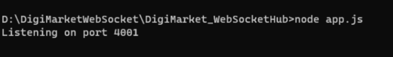

# DigiMarket_WebSocketHub Repository  
### Requirements:  
`Node js v16.17.1`  
you have to install all the packages inside the socket folder using command:  
`npm install`  
To run socket server you just need to run a command in cmd i.e  
`node app.js`  
You will see below as success message  
  
### Video Guide Below  
[https://www.awesomescreenshot.com/video/17735146?key=f41ef6d2a4bc1e69f89d2772793e0de7](https://www.awesomescreenshot.com/video/17735146?key=f41ef6d2a4bc1e69f89d2772793e0de7)